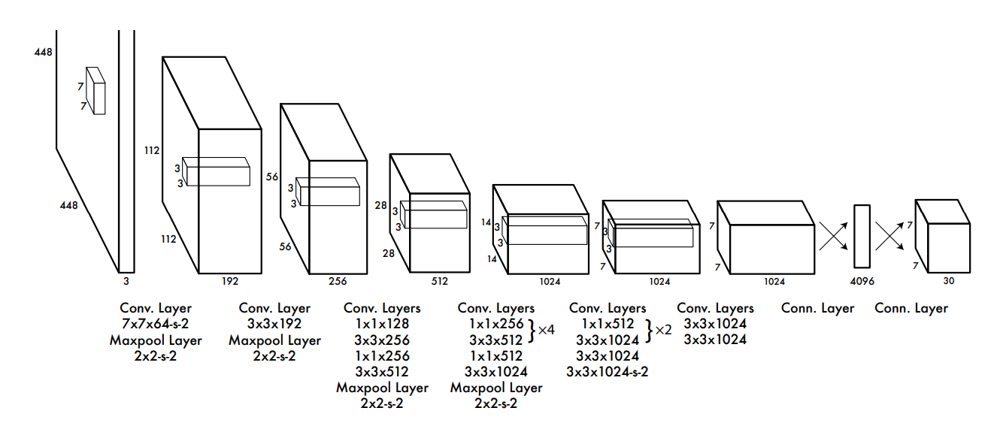
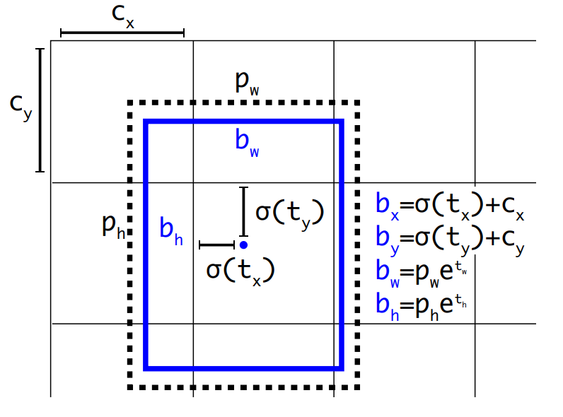

## YOLO Architecture

This implementation uses a **ResNet-18 backbone** combined with the **pure convolutional design** of YOLOv2 and the **detection head structure** of YOLOv1.

- **YOLOv1:** Introduced grid-based bounding box prediction and a unified detection head.  
  [arXiv:1506.02640](https://arxiv.org/pdf/1506.02640)
- **YOLOv2:** Introduced a fully convolutional backbone and anchor-based improvements.  
  [arXiv:1612.08242](https://arxiv.org/pdf/1612.08242)

<table>
<tr>
  <td align="center" width="65%">
    
    <br><em>YOLOv1 Architecture (<a href="https://arxiv.org/pdf/1506.02640">Redmon et al., 2015</a>)</em>
  </td>
  <td align="center" width="35%">
    
    <br><em>YOLOv2 Encoding (<a href="https://arxiv.org/pdf/1612.08242">Redmon & Farhadi, 2016</a>)</em>
  </td>
</tr>
</table>

---

## Showcase

<p align="center">
  
  &nbsp;
  
</p>

<p align="center"><em>Left: input sheet — Right: model prediction</em></p>

---

## Clone Repository

Clone only the **main branch** (~550 MB) instead of the entire repository (> 2 GB due to the _ultralytics_ branch):

```bash
git clone --single-branch --branch main --depth 1 https://gitlab.hs-flensburg.de/alha7503/obb_anns_hausarbeit.git
```

---

## Setup

**File:** `setup.ipynb`

1. Execute first code cell → `pip install gdown` (Google Drive Python API)
2. Execute second code cell → download **DeepScoresV2** dataset

---

## Note

This repository was **initially based on** [yvan674/obb_anns](https://github.com/yvan674/obb_anns), which provided helper functions for DeepScoresV2 processing.  
All original implementations have since been **removed**, though the early reference remains visible in the commit history.

---

## Dataset Statistics

**File:** `dataset_statistics.ipynb`

- Annotation-density distribution for various detection-grid resolutions
- Class-occurrence scatter plot and summary table

---

## Demo, Model Size, Recall & Precision, Training Losses

**File:** `model_and_training_evaluation.ipynb`

- Render any image: place it in `presentation/demo/images/` (as `.png`)  
  and call `demo("image.png")`
- Visualizes:
  - **Model size**
  - **Precision–Recall curve**
  - **Training losses** and **mAP/REC per epoch**

---

## observe_training.ipynb

Track **loss evolution** and **model performance** in real time during training.

---

## ModelSeries.py

Central class to **track training progress** and configuration of a model.  
Visualizations appear in `model_and_training_evaluation.ipynb`.

- Creates **weight checkpoints** at regular intervals
- `LearnConfig`: tracks loss parameters per epoch
- `EvalRecord`: tracks overall and per-class performance per epoch

---

## training.ipynb

Configure and initiate model training.  
Uses the `Trainer` class from `trainer2.py`.

---

## config.py

Adjusting **N**, **S**, or **RES** requires corresponding stride changes within `model.py`.

| Parameter   | Description                                                                                                                         |
| ----------- | ----------------------------------------------------------------------------------------------------------------------------------- |
| **N**       | Detection-head resolution                                                                                                           |
| **S**       | Grid resolution on the input image (e.g. if `N = S`, the full image is processed; if `S // N = 3`, the image is split into 9 crops) |
| **RES**     | Input image resolution                                                                                                              |
| **A**       | Number of anchors                                                                                                                   |
| **ANCHORS** | Anchor box dimensions                                                                                                               |

---

## loss.py

See **lines 153–171** for details on the **inconsistency** between _mAP_ (evaluation) and the implemented loss function.

---

## util.py

Contains the class **`DataExtractor`**, which processes  
`ds2_dense/deepscores_train.json` according to `config.py` to create a formatted DataFrame for training and evaluation.

Also includes helper functions for:

- Loading / saving model weights
- Visualizing predictions
- Other utility routines used across notebooks

---

## eval.py

Implements evaluation metrics such as **mAP**, **mREC**, and related analysis utilities.

---
